# Introduction

This project contains a machine learning system to identify **function boundaries** and **instruction boundaries** in stripped binary executable files using a BERT-based transformer model.

## How it works

The model operates directly on raw bytes of the `.text` section. A shared BERT encoder processes chunks of binary data. Two independent classification heads predict per-byte labels:

- **Function boundary head** (3 classes): `O` (other), `B-FUNC` (function start), `E-FUNC` (function end)
- **Instruction boundary head** (2 classes): `NOT-START`, `INST-START`

The model uses a multi-task dual-head architecture.

Ground truth for function boundaries is extracted from `.symtab` / `.eh_frame` ELF sections. Ground truth for instruction boundaries is obtained by linearly disassembling the `.text` section with [Capstone](https://www.capstone-engine.org/).

## Setup

You will need [uv](https://github.com/astral-sh/uv). 

Our trained models (including benchmarks) can be found [here](https://huggingface.co/collections/ichters/reveng).

## Usage

Run using `uv`. Dependencies will be installed automatically by `uv`.

```bash
# show all cli commands
uv run python -m reveng_ml --help
# or for a specific command
uv run python -m reveng_ml <command> --help
```

### 1. Split dataset

```bash
uv run python -m reveng_ml split-dataset --input-dir <raw-binaries-dir> --train-dir <train-dir> --test-dir <test-dir>
```

### 2. Create dataset

Preprocesses binaries into chunked, labelled tensors and saves them to a `.dataset` file for fast reuse.

```bash
uv run python -m reveng_ml create-dataset --input-dir <train-dir> --output-path <output>.dataset
```

### 3. Train

`--data-path` accepts either a pre-built `.dataset` file (fast) or a raw binary directory (dataset is built on the fly).

```bash
uv run python -m reveng_ml train --data-path <train>.dataset --model-dir <model-dir>
# or
uv run python -m reveng_ml train --data-path <train-dir> --model-dir <model-dir>
```

**Key training options:**

| Option               | Default  | Description                                                                              |
|----------------------|----------|------------------------------------------------------------------------------------------|
| `--task`             | `both`   | `function`, `instruction`, or `both`                                                     |
| `--epochs`           | `3`      | Number of training epochs                                                                |
| `--batch-size`       | `32`     | Samples per batch                                                                        |
| `--lr`               | `5e-5`   | Learning rate                                                                            |
| `--class-weight`     | auto     | Weight for boundary classes (B-FUNC, E-FUNC). If unset, computed from label distribution |
| `--inst-loss-weight` | `1.0`    | Weight of instruction loss relative to function loss                                     |
| `--arch`             | `x86_64` | Architecture for disassembly: `x86_64`, `x86_32`, `arm`                                  |

### 4. Evaluate

```bash
uv run python -m reveng_ml evaluate --model-path <model>.bin --data-path <test>.dataset
# or
uv run python -m reveng_ml evaluate --model-path <model>.bin --data-path <test-dir>
```

## Unit tests

```bash
uv run pytest
```

## Architecture Overview

### Data Collection

The project used automated pipelines to gather and compile C/C++ source code into binary executables to serve as training data.

**Google BigQuery Pipeline:** The Google BigQuery GitHub public dataset was used initially to aquire training data on a large scale. 
After creating a new Google Cloud account, the user has 300 EUR in free credits, which is sufficient to run our BigQuery SQL script on the entire public GitHub dataset. 
We collected about 700GB of compressed C code from GitHub via BigQuery.
The SQL script is located at `scripts/legacy/BigQuery_GitHub_C.sql` and collects all C source files and header files, along with their corresponding repository names and paths.
The `CompilePipeline.py` script processes large `.tar.gz` JSON dumps exported from BigQuery in chunks to handle disk and memory constraints. 
It sequentially extracts source files, attempts to compile them, and tracks progress in a `pipeline_state.json` file, so the process can be safely paused and resumed.
Our collection of all binaries that compiled successfully is available on [HeiBox (total 1.8GB)](https://heibox.uni-heidelberg.de/d/c792e037da654e528cd3/).

**Current Pipeline:** The new pipeline pulls and compiles packages from sources like Debian, GNU, and [TheStack dataset](https://huggingface.co/datasets/bigcode/the-stack). 
It parallelizes compilation across a matrix of configurations (`gcc` and `clang` with optimization levels `O0` to `O3`), and organizes the resulting binaries in a structured directory format. It also includes C++ code, unlike our BigQuery dataset.



### Machine Learning Pipeline
Our ML pipeline is executed using our CLI (`uv run python -m reveng_ml`). Various subcommands trigger different stages of the pipeline.

#### Dataset Splitting (`split-dataset`)

Separates raw binaries into `train/` and `test/` directories, grouped by repository (so GCC and Clang versions of the same file stay in the same split).

#### Dataset Creation (`create-dataset`)

*   Reads unstripped ELF binaries and determines function boundaries and instruction boundaries.
    * Ground truth for function boundaries is detected using the `.symtab` section of the ELF. As a fall-back, we also support reading DWARF info from the `.eh_frame` section if `.symtab` is not available. Instruction boundaries are extracted using Capstone.
    * Labels for function boundaries: `O` (Other), `B-FUNC` (Begin), `E-FUNC` (End).
    * Labels for instruction boundaries: `NOT-START`, `INST-START`.
*   Calls `strip` to remove symbols.
*   Chunks `.text` section of the stripped binary into overlapping sequences for training (default: 510 bytes per chunk, stride 255 bytes).
*   Saves the dataset as a file.

#### Training (`train`)

The training loop uses the `AdamW` optimizer with a linear learning rate scheduler (including a warmup phase), to ensure stable gradient descent in the early epochs. 
During each forward pass, the trainer computes a loss function that aggregates the cross-entropy loss from both the function and instruction classification heads. 
Because classifying boundary tokens introduces a large class imbalance against the standard byte tokens, the trainer automatically computes dynamic class weights by default, although it also allows for manual weight configuration via a command-line argument.
The balance between the two learning tasks is controlled via an instruction loss weight parameter. Tweaking this parameter forces the optimizer to 
prioritize instruction mapping over function mapping, or the other way around.
`clip_grad_norm` is applied to the backward pass to prevent exploding gradients by clipping the maximum value of the gradients to 1.0.

#### Evaluation (`evaluate`)

Runs inference over the test dataset, outputting precision, recall, F1-scores, confusion matrices, and class distributions.